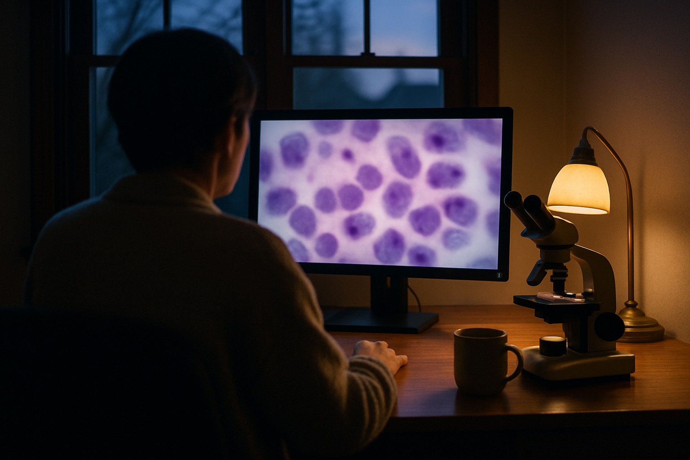

# [법안 산책] 미국 검사실 원격 판독 합법화 이야기 (feat. 세포병리만 예외)

> 📜 **Clinical Laboratory Improvement Amendments of 1988 (CLIA); Virtual Access, Gynecologic Cytology Proficiency Testing (PT), Personnel Qualifications, and Other Changes**
> 원안 전문: https://www.federalregister.gov/d/2026-20613

✅ 제안 → 🔵 **의견수렴** → ⬜ 심사·작성 → ⬜ 확정 공포 → ⬜ 시행

| 단계 | 상태 | 날짜·비고 |
|---|---|---|
| ① 제안 공포 | ✅ 완료 | 2026-10-08 |
| ② 의견수렴 | 🔵 **지금 여기** | ~2026-12-07 마감 (D-58) |
| ③ 확정안 심사·작성 | ⬜ 아직 |  |
| ④ 확정(Final Rule) 공포 | ⬜ 아직 |  |
| ⑤ 시행 | ⬜ 아직 |  |

---

1. 미국에서는 1988년에 만든 CLIA라는 법에 따라, 정부 인증을 받은 검사실만 환자의 혈액·조직 검사를 할 수 있음.

2. 이 법이 만들어진 1988년에는 현미경 슬라이드를 컴퓨터 파일로 바꿔 멀리서 들여다보는 기술이 없어서, 의사가 검사실 밖에서 검사 결과를 판독해도 되는지에 대한 규정 자체가 없었음.

3. 코로나19가 터지자 미국 정부는 집행재량(규정 위반이지만 당분간 단속하지 않겠다고 공식적으로 봐주는 것)이라는 임시 방침으로 원격 판독을 사실상 허용해 왔음.

4. 몇 년간 지켜봤더니 품질 문제가 특별히 발견되지 않았고, 2024년에는 미국 FDA가 세포 검사를 디지털 화면으로 하는 시스템을 처음으로 승인해 유리 슬라이드 없이 컴퓨터 이미지로 검사하는 시대가 이미 열리고 있었음.

5. 2026년 10월 8일, 미국 보건복지부(CMS와 CDC)가 이 임시 허용을 정식 규정으로 만들겠다는 개정안을 발표했음.

6. 핵심은 '가상 접근'이라는 개념을 새로 만드는 것으로, 병리의사(혈액·조직·세포를 들여다보고 병이 있는지 판정하는 의사)가 검사실 건물 밖에서 보안이 걸린 인터넷 연결로 검사 데이터와 이미지를 판독하는 것을 본원 검사실의 인증 하나만으로 허용한다는 뜻임.

7. 단 예외가 하나 있는데, 세포병리(낱개 세포를 들여다보고 암 같은 병을 찾아내는 검사 분야)는 법률상 검사실 안에서 해야 한다고 못 박혀 있어서, 원격으로 판독하려면 그 장소마다 별도 인증을 받아야 함.

8. 세포병리 원격 판독에 대한 기존의 '봐주기'도 2026년 3월 23일자로 이미 끝났음.

9. 부인과 세포 검사 능력시험(PT, 검사 실력이 있는지 주기적으로 치르는 시험)에서는 유리 슬라이드 대신 디지털 이미지를 쓸 수 있게 되고, 대신 시험 부정을 감시하는 체계를 의무적으로 갖춰야 함.

10. 강화됐던 검사실 책임자(디렉터) 자격 요건은 업계 부담이 크다는 지적을 받아들여 이전 수준으로 완화·표준화하고, 의사가 수련(레지던트·펠로우십) 중 최소 1년간 검사실 훈련을 받았으면 책임자 자격을 인정하는 길도 새로 열림.

11. 디지털 이미지도 검사 기록처럼 보관 의무 대상에 추가되어, 일정 기간 지워선 안 됨.

12. 원격 판독은 아무 데서나 하면 안 되고, 보안 네트워크 연결 위에서 기밀이 지켜지는 환경에서만 하도록 의무화됨.

13. 능력시험까지 디지털 이미지로 볼 수 있게 되면서 디지털 전환을 막던 마지막 규제 걸림돌이 사라짐 → 슬라이드를 스캔하는 장비와 판독 시스템, 즉 디지털 병리 장비·디지털 세포진단 시스템 (슬라이드 스캐너·판독 시스템)의 수요가 늘어날 수 있음.

14. 원격 판독이 별도 인증 없이 합법화되고 인력 자격 요건도 완화되어, 임상검사 수탁(진단검사실) 산업은 인증·인력 운용 비용이 직접 줄어듦.

15. 원격 판독을 도입하는 검사실마다 시스템 연동과 보안망 구축 지출이 생김 → 이것이 의료 IT·검사실정보시스템(LIS)·보안 네트워크 산업의 매출이 됨.

16. 디지털 이미지가 보관 의무 대상에 새로 들어가면서, 용량이 큰 병리 이미지를 오래 저장해야 하는 수요가 데이터 스토리지·의료영상 아카이빙 산업에 새로 생김.

17. 피부과(Mohs 수술) 의원·검사실은 강화됐던 책임자 자격 요건이 다시 완화되어, 신규 개원과 지방 진료의 걸림돌이 풀리고 운영 비용이 줄어듦.

18. 반면 원격 세포병리 판독(텔레사이톨로지) 서비스는 원격 장소마다 별도 인증을 따고 유지하는 비용이 확정됐음.

19. 능력시험(PT) 프로그램 운영기관 (CAP·ASCP 등)은 시험 부정을 감시하는 체계를 의무적으로 갖추는 비용을 부담하게 되지만, 디지털 시험 상품을 새로 팔 기회가 이를 일부 상쇄할 수 있음.

20. 의무였던 추가 20시간 교육 요건이 면제·완화되면, 검사실 디렉터 계속교육(CE) 제공 산업은 교육 강좌를 들어야 할 사람 자체가 구조적으로 줄어듦.

21. 의견 제출 마감은 2026년 12월 7일로, 병리학회(CAP)·피부과학회·환자단체가 낸 의견의 찬반 구도가 첫 번째 관전 포인트임.

22. 최종규칙 공포 후 약 6개월 뒤 CAP·ASCP의 디지털 이미지 기반 부인과 세포진단 능력시험 프로그램 출시와 HHS 승인 발표가 나오는지, 그리고 2027년 실적 발표 시즌에 디지털 병리 장비 업체들의 수주·실적 관련 발언에 이번 규정 변경이 반영되는지를 지켜볼 필요가 있음.

**한 줄 코멘트**: 코로나 때 임시로 봐주던 관행이 정식 규칙이 되는 과정이고, 규제가 풀리는 길목에 장비·의료 IT·스토리지 수요가 놓여 있음. 다만 세포병리만 별도 인증 부담이 확정되는 예외라는 점은 기억해 둘 필요가 있겠음.

---

**영향 산업 한눈에**

| 산업 | 방향 |
|---|---|
| 디지털 병리 장비·디지털 세포진단 시스템 (슬라이드 스캐너·판독 시스템) | 🟢 수혜 |
| 임상검사 수탁(진단검사실) 산업 | 🟢 수혜 |
| 의료 IT·검사실정보시스템(LIS)·보안 네트워크 산업 | 🟢 수혜 |
| 데이터 스토리지·의료영상 아카이빙 산업 | 🟢 수혜 |
| 피부과(Mohs 수술) 의원·검사실 | 🟢 수혜 |
| 원격 세포병리 판독(텔레사이톨로지) 서비스 | 🔴 부담 |
| 능력시험(PT) 프로그램 운영기관 (CAP·ASCP 등) | 🔴 부담 |
| 검사실 디렉터 계속교육(CE) 제공 산업 | 🔴 부담 |

---

**용어**
- **CLIA 인증**: 미국에서 환자 검사를 하는 검사실이 반드시 받아야 하는 정부 허가증. 1988년 법(CLIA)에 따라 이 인증 없이는 혈액·조직 검사를 할 수 없다.
- **세포병리(cytology)**: 낱개 세포를 들여다보고 암 같은 병을 찾아내는 검사 분야. 자궁경부암 검사가 대표적인 예다.
- **능력시험(PT)**: 검사실과 검사 인력이 제대로 검사할 실력이 있는지 주기적으로 치르는 시험. 운전면허 갱신 시험처럼, 통과해야 계속 검사를 할 수 있다.

---

### ⚠️ 이 글은 투자 권유 목적이 아니며, 투자에 대한 책임은 본인에게 있습니다.

_이 글은 AI의 도움을 받아 작성한 글이며, 대표 이미지는 AI가 생성한 이미지입니다._
